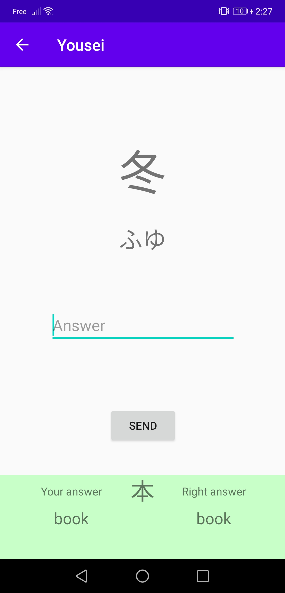
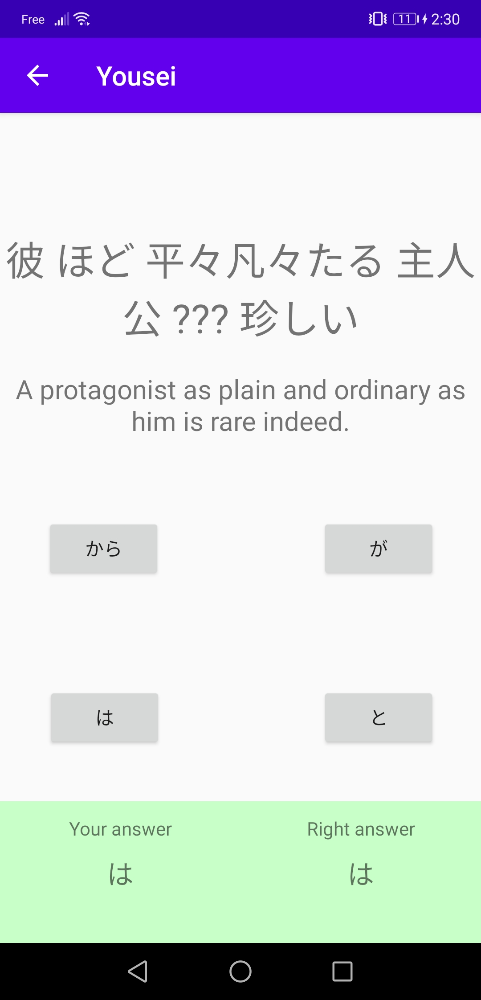
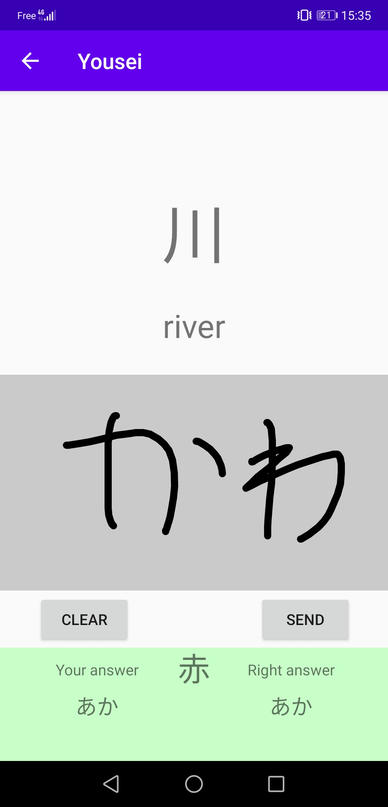

# Yousei
An android app to help learning Japanese

   
Preview images may not be from the latest version of the app

## Philosophy
Yet another application to learn Japanese... But why? 
There are a lot of app out there but there are some important points I'ld like to find more often:
 - Gamification: I think it's easier to learn with things like experience points and achievements
 - Clever quizzes: If you ask me if "読む" means "to read", "book" or "pencil", I could easily answer "to read", but just because I can see that it's a verb, and not necessarly because I know the word
 - Write kanji/hiragana with your finger: Because it's always better (and harder) than picking an answer between a list of 4
 - No intrusive ads: Everybody hates them, me included
 
So that's why I'm making this app, it's my first time using Android Studio (and my Japanese is pretty weak too) so please don't except too much from this project.

## Download it
**Please make note that I'm still actively working on the app and that the current alpha versions doesn't contains all the features said above yet** 
You can download the current version of the app on the [release page](https://github.com/Xwilarg/Yousei/releases)

## Others
You're maybe wondering how I'm getting all the information I need about the Japanese language 
Well to begin with, all the needed information are stored [here](app/src/main/res/raw) 
I'm either getting them from [Jisho](https://jisho.org/) (for the kanji/vocabulary) or from [WWWJDIC](http://www.edrdg.org/cgi-bin/wwwjdic/wwwjdic) for the particle exercices 
After getting there information, I'm using [JishoParser](https://github.com/Xwilarg/JishoParser) to change them into JSON files 
To recognize what you draw, I'm using [Google ML Kit](https://developers.google.com/ml-kit/vision/digital-ink-recognition/)
